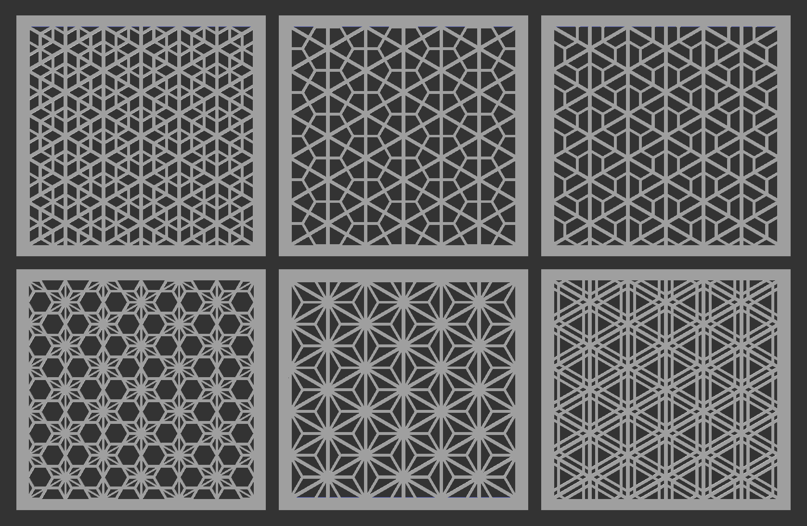

# Kumiko Patterns

This is an OpenSCAD implementation of various traditional japanese Kumiko patterns.
They are all based on the triangle shape and add various infills.
Implemented right now are the following patterns:

- Mikado
- Tsumiishi Kikko
- Bishamon Kikkou
- Tobi Asanoha
- Asanoha
- Goma

(left to right, top to bottom)

I am sorry if I butchered those names or got the naming entirely wrong, 
please contact me if I need to fix them or just create a PR :)

## Usage

To use those patterns in your OpenSCAD scripts, copy the `kumiko.scad` file 
into the same directory as your script, then include it with `use <kumiko.scad>`.
To create a pattern of your choice, invoke the respective module like so:

`goma(cellSize=20, widthInCells=6, heightInCells=5, gap=3, strength=1.6, fillingStrength=1.2);`

See the [demo.scad](demo.scad) file for more usage examples.

- `cellSize` is the edge length of the base triangle shape
- `widthInCells` is the width of the created pattern, in full triangles. A value of 4 will create a pattern that is 4 triangles wide.
- `heightInCells` is similar to `widthInCells`, just for the height of the pattern.
- `gap` is specific to the Goma pattern and specifies the space between parallel lines, not taking the line strength into account.
- `strength` is the width of the base triangle lines.
- `fillingStrength` is the width of the lines inside the base triangles.

## Implementation notes

The triangle-based patterns are created by first building a base triangle pattern, 
and then building the infill patterns by rotating a given line pattern 
around the intersection points of the base triangles.

If you want to implement additional point-symmetric patterns, 
please align the implementation with the existing ones to ease code understandability and maintainability.
If you want to implement patterns not based on non-overlapping triangles,
you are free to do it any way you like (until a common pattern is established).
